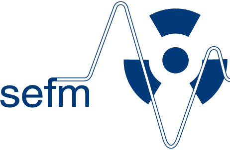
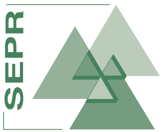

# Cursos SEFM 2019

## Noviembre

| Fecha                      | Título                                                                                                                                                                              |                                                                                Avalado                                                                               |        Sede        |
| :------------------------- | :---------------------------------------------------------------------------------------------------------------------------------------------------------------------------------- | :------------------------------------------------------------------------------------------------------------------------------------------------------------------: | :----------------: |
| 18-22 de Noviembre de 2019 | [Advanced QA protocols: use and development. Going beyond existing or outdated QC standards](http://eutempe-net.eu/mpe06/)                                                          |                                                                                                                  |  Lovaina (Bélgica) |
| 21-22 de Noviembre de 2019 | [7th GEC-ESTRO workshop](https://www.estro.org/Workshops/2019/GEC-ESTRO/7TH-GEC-ESTRO-WORKSHOP)                                                                                     |                                                                                                                        | Budapest (Hungría) |
| 13-15 de Noviembre de 2019 | [XII Curso de instrumentación y control de calidad en medicina nuclear](http://www.aulaclinic.com/cursos/561/xii-curso-de-instrumentacion-y-control-de-calidad-en-medicina-nuclear) |                                                                        | Barcelona (España) |
| 11-15 de Noviembre de 2019 | [Aplicaciones del almacenamiento de energía en sistemas eléctricos](http://www.ciemat.es/cargarFichaCursoWeb.do?texto=&identificador=427&idCategoria=0&fechaDesde=&fechaHasta=)     |                                                                                                                    |   Madrid (España)  |
| 10-11 de Noviembre de 2019 | [II Workshop en Braquiterapia intersticial en el cáncer de cérvix](https://www.brachyacademy.com/es/events/interstitial-brachytherapy-of-cervical-cancer/)                          |   |  Pamplona (España) |
| 3-6 de Noviembre de 2019   | [Research Course in Radiotherapy Physics](https://www.estro.org/school/list-courses-school-main-pages/2019-courses/2019-madrid-research-course-in-radiotherapy-physics)             |                                                                                                                        |   Madrid (España)  |

## Octubre

| Fecha                    | Título                                                                                                                                                                                                                                                                           |                                              Avalado |        Sede        |
| :----------------------- | :------------------------------------------------------------------------------------------------------------------------------------------------------------------------------------------------------------------------------------------------------------------------------- | ---------------------------------------------------: | :----------------: |
| Octubre-Noviembre        | [Curso Online de Actualización en Braquiterapia](https://sefm.es/eventos/2a-edicion-curso-online-de-actualizacion-en-braquiterapia/)                                                                                                                                             |           |       Online       |
| 25-26 de Octubre de 2019 | [3rd ESTRO Physics Workshop - Science in Development](https://www.estro.org/Workshops/2019/Physics/3RD-ESTRO-PHYSICS-WORKSHOP-SCIENCE-IN-DEVELOPMENT)                                                                                                                            |        | Budapest (Hungría) |
| 14-16 de Octubre de 2019 | [Optimising the performance of x-ray imaging units](http://eutempe-net.eu/mpe07/)                                                                                                                                                                                                |  |   Guildford (GB)   |
| 13-16 de Octubre de 2019 | [Image-Guided Radiotherapy and Chemotherapy in Gynaecological Cancer: Focus on MRI Based Adaptive Brachytherapy](https://www.estro.org/school/list-courses-school-main-pages/2019-courses/2019-cluj-image-guided-rt-and-chemotherapy-in-gynae-ca-focus-on-mri-based-adaptive-bt) |        |  Dublin (Irlanda)  |
| 12-16 de Octubre de 2019 | [Image-Guided Radiotherapy and Chemotherapy in Gynaecological Cancer: Focus on MRI Based Adaptive Brachytherapy](https://www.estro.org/school/list-courses-school-main-pages/2019-courses/2019-cluj-image-guided-rt-and-chemotherapy-in-gynae-ca-focus-on-mri-based-adaptive-bt) |        |   Cluj (Rumanía)   |

## Septiembre

| Fecha                                 | Título                                                                                                                                                                                                                                                            |                                              Avalado |        Sede        |
| :------------------------------------ | :---------------------------------------------------------------------------------------------------------------------------------------------------------------------------------------------------------------------------------------------------------------- | ---------------------------------------------------: | :----------------: |
| 29 de Septiembre-3 de Octubre de 2019 | [Imaging for Physicists](https://www.estro.org/school/list-courses-school-main-pages/2019-courses/2019-manchester-imaging-for-physicists)                                                                                                                         |        |   Manchester (GB)  |
| 24-28 de Septiembre de 2019           | [Advanced diagnostic and interventional radiology](http://eutempe-net.eu/mpe04/)                                                                                                                                                                                  |  |  Ferrara (Italia)  |
| 22-26 de Septiembre de 2019           | [Advanced Treatment Planning](https://www.estro.org/school/list-courses-school-main-pages/2019-courses/2019-budapest-advanced-treatment-planning)                                                                                                                 |        | Budapest (Hungría) |
| 18-20 de Septiembre de 2019           | [DICOM 101](https://sefm.es/eventos/digital-imaging-and-communications-in-medicine-dicom-101/)                                                                                                                                                                    |           |  Granada (España)  |
| 8-12 de Septiembre de 2019            | [Physics for Modern Radiotherapy](https://www.estro.org/school/list-courses-school-main-pages/2019-courses/2019-riga-physics-for-modern-radiotherapy)                                                                                                             |        |   Riga (Letonia)   |
| 1-5 de Septiembre de 2019             | [Clinical Practice and Implementation of Image-Guided Stereotactic Body Radiotherapy](https://www.estro.org/school/list-courses-school-main-pages/2019-courses/2019-florence-clinical-practice-and-implementation-of-image-guided-stereotactic-body-radiotherapy) |        | Florencia (Italia) |

## Agosto

## Julio

| Fecha                 | Título                                                                                                 |                                                                                          Avalado |        Sede        |
| :-------------------- | :----------------------------------------------------------------------------------------------------- | -----------------------------------------------------------------------------------------------: | :----------------: |
| 8-26 de Julio de 2019 | [3º Curso de Imagen Médica y Protonterapia](http://protonterapia.wixsite.com/ecv2019)                  |                                                     |   Madrid (España)  |
| 8-12 de Julio de 2019 | [EUTEMPE - MPE03: Monte Carlo simulation of X-ray imaging and dosimetry](http://eutempe-net.eu/mpe03/) |   | Barcelona (España) |

## Junio

| Fecha                  | Título                                                                                                                                                                                                                                      |                                                                                 Avalado |                   Sede                  |
| :--------------------- | :------------------------------------------------------------------------------------------------------------------------------------------------------------------------------------------------------------------------------------------ | --------------------------------------------------------------------------------------: | :-------------------------------------: |
| 13-15 de Junio de 2019 | [Brachytherapy for Prostate Cancer](https://www.estro.org/Courses/BRACHYTHERAPY-FOR-PROSTATE-CANCER)                                                                                                                                        |                                           |         Praga (República Checa)         |
| 11 de Junio de 2019    | [Radioterapia Guiada por Superficies](https://sefm.es/eventos/radioterapia-guiada-superficies/)                                                                                                                                             |   | Congreso conjunto SEFM/SEPR Burgos 2019 |
| 11 de Junio de 2019    | [Dosimetría Interna en Tratamientos de Medicina Nuclear](https://sefm.es/eventos/dosimetria-interna-tratamientos-medicina-nuclear/)                                                                                                         |   | Congreso conjunto SEFM/SEPR Burgos 2019 |
| 11 de Junio de 2019    | [Uso avanzado de MCNP en dosimetría de radiaciones: cálculo de dosis absorbida al paciente y cálculo de blindajes](https://sefm.es/eventos/uso-avanzado-mcnp-dosimetria-radiaciones-calculo-dosis-absorbida-al-paciente-calculo-blindajes/) |   | Congreso conjunto SEFM/SEPR Burgos 2019 |
| 11 de Junio de 2019    | [Novedades en la protección contra las Radiaciones No Ionizantes](https://sefm.es/eventos/novedades-la-proteccion-las-radiaciones-no-ionizantes/)                                                                                           |   | Congreso conjunto SEFM/SEPR Burgos 2019 |
| 3-7 de Junio de 2019   | [Minieólica para autoconsumo](http://www.ciemat.es/cargarFichaCursoWeb.do?texto=&identificador=428&idCategoria=0&fechaDesde=&fechaHasta=)                                                                                                   |                                       |             Madrid (España)             |
| 3-7 de Junio de 2019   | [Anthropomorphic phantoms for optimization of dose and image quality in radiology](http://eutempe-net.eu/mpe05/)                                                                                                                            |                                     |             Varna (Bulgaria)            |
| 2-6 de Junio de 2019   | [IMRT and Other Highly Conformal Techniques in Practice](https://www.estro.org/school/list-courses-school-main-pages/2019-courses/2019-budapest-imrt-and-other-conformal-techniques-in-practice)                                            |                                           |            Budapest (Hungría)           |
| 2-5 de Junio de 2019   | [Target Volume Determination – From Imaging to Margins](https://www.estro.org/school/list-courses-school-main-pages/2019-courses/2019-athens---target-volume-determination---from-imaging-to-margins)                                       |                                           |             Atenas (Grecia)             |

## Mayo

| Fecha                  | Título                                                                                                                                                                                                                                      |                                                                                 Avalado |                   Sede                  |
| :--------------------- | :------------------------------------------------------------------------------------------------------------------------------------------------------------------------------------------------------------------------------------------ | --------------------------------------------------------------------------------------: | :-------------------------------------: |
| 19-23 de Mayo de 2019  | [Dose Modelling and Verification for External Beam Radiotherapy](https://www.estro.org/school/list-courses-school-main-pages/2019-courses/2019-lisbon-dose-modelling-and-verification-for-external-beam-radiotherapy)  | ](https://estro.org/)  | Lisboa (Portugal)  |
| 20-22 de Mayo de 2019  | [Curso Blindajes en Instalaciones Sanitarias](https://www.sepr.es/convocatorias/eventodetalle/421/148/curso-blindajes-frente-a-radiaciones-en-las-instalaciones-sanitarias-2019?filter_reset=1)  |     | Madrid (España)  |
| 15-17 de Mayo de 2019  | [VI Mediterranean Thematic Workshop in Advanced Molecular Imaging](https://www.i3m.upv.es/medami2019/)  |   |  Valencia (España) |
| 6-10 de Mayo de 2019  | [Advanced techniques for enhancing image quality in CT](http://eutempe-net.eu/mpe08/)  | ](http://eutempe-net.eu/)  | Lausana (Suiza)  |

## Abril

| Fecha                  | Título                                                                                                                                                                                                                                      |                                                                                 Avalado |                   Sede                  |
| :--------------------- | :------------------------------------------------------------------------------------------------------------------------------------------------------------------------------------------------------------------------------------------ | --------------------------------------------------------------------------------------: | :-------------------------------------: |
|  9 de Abril de 2019 | [5th European Particle Therapy Network (EPTN)](https://estro.org/congresses-meetings/items/5th-european-particle-therapy-network-eptn)  |   | Bruselas (Bélgica)  |
| 5-9 de Abril de 2019  | [Dosimetría en campos pequeños. Verificación de planes de tratamiento y control de calidad en IMRT/VMAT](https://sefm.es/eventos/dosimetria-campos-pequenos-verificacion-planes-tratamiento-control-calidad/)  |   | Pamplona (España)  |
| 5-6 de Abril de 2019  |  [Reunión GORVAMUR post-ASTRO](http://gorvamur.org/eventos/reunion-post-astro-2018) |   | Valencia (España) |
|   |   |   |   |
